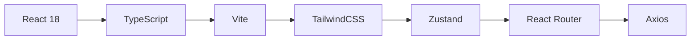
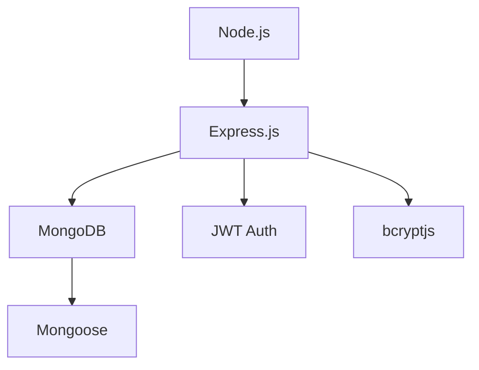
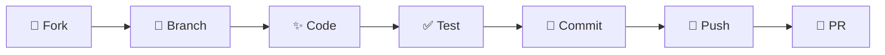

<div align="center">

# 🎬✨ BookMyRadiant

### *Your Gateway to Cinematic Excellence*

<p align="center">
  
  
  
  
  
</p>

<p align="center">
  
  
  
</p>

> **A modern, full-stack cinema booking platform that brings the magic of movies to your fingertips. Browse films, select your perfect seats, and book shows with seamless elegance.**

<p align="center">
  <a href="#-live-demo"><strong>🚀 Live Demo</strong></a> •
  <a href="#-quick-start"><strong>📖 Get Started</strong></a> •
  <a href="#-features"><strong>✨ Features</strong></a> •
  <a href="#-api-documentation"><strong>📚 API Docs</strong></a>
</p>

---

</div>

## 🎥 See It In Action

<div align="center">

### 🏠 Discover Movies & Browse Cinemas

</div>

---

## 🌟 Why BookMyRadiant?

<table>
<tr>
<td width="50%">

### 🎭 For Movie Enthusiasts

✨ **Seamless Discovery**
Browse an extensive movie catalog powered by OMDb & TMDb APIs with stunning visuals

🪑 **Smart Seat Selection**  
Interactive seat maps with live availability updates and instant booking confirmation

🎪 **Multiple Venues**  
Access shows across different cinema locations in your area

⏰ **Flexible Scheduling**  
Choose from various showtimes that fit your schedule perfectly

📱 **Personal Hub**  
Manage your profile, track bookings, and revisit your cinema history

</td>
<td width="50%">

### 👨‍💼 For Administrators

🏢 **Cinema Management**  
Effortlessly add, edit, and oversee multiple cinema locations

🎬 **Showtime Control**  
Schedule and manage movie showtimes with intuitive tools

🎨 **Layout Customization**  
Configure unique seat arrangements for different screens

📊 **Analytics Dashboard**  
Monitor bookings, track revenue, and gain valuable insights

🔐 **Secure Operations**  
Role-based access control with JWT authentication

</td>
</tr>
</table>

---

## 🚀 Features

<div align="center">

| 🎯 Feature | 📝 Description | 🌟 Benefit |
|:----------:|:---------------|:-----------|
| **🎬 Movie Browse** | Rich movie catalog with posters, ratings & details | Discover your next favorite film |
| **🪑 Live Seat Map** | Real-time seat availability with visual selection | Pick the perfect spot every time |
| **⚡ Instant Booking** | Quick checkout with immediate confirmation | No waiting, just watching |
| **📱 Responsive Design** | Flawless experience on desktop, tablet & mobile | Book anywhere, anytime |
| **🔒 Secure Auth** | JWT-based authentication with encrypted passwords | Your data is safe with us |
| **🎫 Booking History** | Complete transaction history with cancellation | Stay organized effortlessly |
| **👑 Admin Panel** | Comprehensive management dashboard | Total operational control |
| **🎨 Modern UI** | Clean, intuitive interface with smooth animations | Delightful user experience |

</div>

---

## 🛠️ Tech Stack

<div align="center">

### Frontend Arsenal



| Technology | Version | Purpose |
|:----------:|:-------:|:--------|
| ⚛️ **React** | 18.3.1 | Modern UI with hooks & components |
| 📘 **TypeScript** | 5.5.3 | Type-safe development experience |
| ⚡ **Vite** | 5.4.2 | Lightning-fast HMR & builds |
| 🎨 **TailwindCSS** | 3.4.1 | Utility-first responsive styling |
| 🗂️ **Zustand** | 5.0.8 | Lightweight state management |
| 🛣️ **React Router** | 7.9.4 | Seamless client-side navigation |
| 🌐 **Axios** | 1.12.2 | Promise-based HTTP client |
| 🎭 **Lucide React** | 0.344.0 | Beautiful, consistent icons |
| 🔥 **React Hot Toast** | 2.6.0 | Beautiful notifications & toasts |
| 🟢 **Supabase** | 2.57.4 | Optional cloud database integration |

### Backend Powerhouse



| Technology | Version | Purpose |
|:----------:|:-------:|:--------|
| 🟢 **Node.js** | 18+ | JavaScript runtime environment |
| 🚂 **Express.js** | 4.18.2 | Fast, minimalist web framework |
| 🍃 **MongoDB** | 8.0 | Flexible NoSQL database |
| 🦸 **Mongoose** | 8.0.0 | Elegant MongoDB object modeling |
| 🔐 **JWT** | 9.0.2 | Stateless authentication tokens |
| 🔒 **bcryptjs** | 3.0.2 | Secure password hashing |
| 🌐 **CORS** | 2.8.5 | Cross-origin resource sharing |
| 🌐 **Axios** | 1.12.2 | HTTP client for API calls |

</div>

---

## 🚀 Quick Start

### 📋 Prerequisites

Ensure you have these tools ready:

```bash
✅ Node.js (v18 or higher)
✅ npm or yarn
✅ MongoDB Atlas Account (or local MongoDB)
✅ OMDb API Key (get from http://www.omdbapi.com/apikey.aspx)
✅ TMDb API Key (get from https://www.themoviedb.org/settings/api)
```

### 📦 Installation

<details>
<summary><b>🔽 Click to expand installation steps</b></summary>

#### **Step 1: Clone the Repository**

```bash
git clone https://github.com/deeptimaan-k/BookMyRadiant.git
cd BookMyRadiant
```

#### **Step 2: Backend Setup**

```bash
# Navigate to backend
cd backend

# Install dependencies
npm install

# Create .env file (use .env.example as template):
# MONGODB_URI=your_mongodb_connection_string
# PORT=5000
# NODE_ENV=development
# JWT_SECRET=your_secure_jwt_secret_here
# TMDB_API_KEY=your_tmdb_api_key
# TMDB_ACCESS_TOKEN=your_tmdb_access_token

# Seed sample data
npm run seed

# Start backend server
npm run dev
```

✅ Backend running on **http://localhost:5000**

#### **Step 3: Frontend Setup**

```bash
# Return to root directory
cd ..

# Install dependencies
npm install

# Create .env file (use .exmaple.env as template):
# VITE_API_URL=http://localhost:5000
# VITE_OMDB_API_KEY=your_omdb_api_key

# Start development server
npm run dev
```

✅ Frontend running on **http://localhost:5173**

</details>

---

## 📁 Project Architecture

```
BookMyRadiant/
│
├── 🎨 src/                  # Frontend source
│   ├── components/          # Reusable UI components
│   │   ├── AddCinemaModal.tsx
│   │   ├── BookingCard.tsx
│   │   ├── CancelConfirmModal.tsx
│   │   ├── CinemaCard.tsx
│   │   ├── EditCinemaModal.tsx
│   │   ├── Header.tsx
│   │   ├── HeroCarousel.tsx
│   │   ├── MovieCard.tsx
│   │   ├── MovieCarousel.tsx
│   │   ├── SeatGrid.tsx
│   │   ├── SeatLayoutModal.tsx
│   │   ├── ShowtimeSelectionModal.tsx
│   │   └── TrailerModal.tsx
│   │
│   ├── pages/               # Route page components
│   │   ├── AdminPage.tsx
│   │   ├── CinemaPage.tsx
│   │   ├── ConfirmationPage.tsx
│   │   ├── HomePage.tsx
│   │   ├── LoginPage.tsx
│   │   ├── MovieDetailsPage.tsx
│   │   ├── MyBookingsPage.tsx
│   │   ├── ProfilePage.tsx
│   │   ├── SeatSelectionPage.tsx
│   │   └── SignupPage.tsx
│   │
│   ├── services/            # API integration layer
│   │   ├── api.ts           # Backend API calls
│   │   └── omdbApi.ts       # OMDb API integration
│   │
│   ├── store/               # Global state management
│   │   ├── bookingStore.ts  # Booking state
│   │   └── userStore.ts     # User authentication state
│   │
│   ├── data/
│   │   └── cinemas.ts       # Cinema data
│   │
│   ├── App.tsx              # Root component with routing
│   ├── main.tsx             # Application entry point
│   └── index.css            # Global styles
│
├── 📦 Root Configuration
│   ├── vite.config.ts       # Vite configuration
│   ├── tailwind.config.js   # Tailwind settings
│   ├── tsconfig.json        # TypeScript config
│   ├── package.json         # Frontend dependencies
│   ├── .env                 # Environment variables
│   └── index.html           # HTML entry point
│
├── 🚂 backend/
│   ├── src/
│   │   ├── config/
│   │   │   └── database.js      # MongoDB connection
│   │   │
│   │   ├── controllers/         # Business logic handlers
│   │   │   ├── authController.js
│   │   │   ├── bookingController.js
│   │   │   ├── cinemaController.js
│   │   │   └── showtimeController.js
│   │   │
│   │   ├── models/              # MongoDB schemas
│   │   │   ├── Booking.js
│   │   │   ├── Cinema.js
│   │   │   ├── Showtime.js
│   │   │   └── User.js
│   │   │
│   │   ├── routes/              # API route definitions
│   │   │   ├── authRoutes.js
│   │   │   ├── bookingRoutes.js
│   │   │   ├── cinemaRoutes.js
│   │   │   ├── showtimeRoutes.js
│   │   │   └── tmdbRoutes.js
│   │   │
│   │   ├── server.js            # Express server setup
│   │   ├── seed.js              # Database seeder
│   │   └── makeAdmin.js         # Admin privilege script
│   │
│   ├── .env.example             # Environment template
│   ├── package.json             # Backend dependencies
│   └── README.md                # Backend documentation
│
└── README.md                    # This file
```

---

## 📚 API Documentation

<details>
<summary><b>🔐 Authentication Endpoints</b></summary>

| Method | Endpoint | Description | Auth Required |
|--------|----------|-------------|---------------|
| `POST` | `/api/auth/signup` | Register new user | ❌ |
| `POST` | `/api/auth/login` | User login | ❌ |
| `GET` | `/api/auth/me` | Get current user | ✅ |

</details>

<details>
<summary><b>🎪 Cinema Endpoints</b></summary>

| Method | Endpoint | Description | Auth Required |
|--------|----------|-------------|---------------|
| `GET` | `/api/cinemas` | List all cinemas | ❌ |
| `GET` | `/api/cinemas/:id` | Get cinema details | ❌ |
| `POST` | `/api/cinemas` | Create cinema | ✅ Admin |
| `PUT` | `/api/cinemas/:id` | Update cinema | ✅ Admin |
| `DELETE` | `/api/cinemas/:id` | Delete cinema | ✅ Admin |

</details>

<details>
<summary><b>🎬 Showtime Endpoints</b></summary>

| Method | Endpoint | Description | Auth Required |
|--------|----------|-------------|---------------|
| `GET` | `/api/showtimes/cinema/:cinemaId` | Cinema showtimes | ❌ |
| `GET` | `/api/showtimes/cinema/:cinemaId/movie/:imdbID` | Movie showtimes | ❌ |
| `POST` | `/api/showtimes` | Create showtime | ✅ Admin |
| `PUT` | `/api/showtimes/:id` | Update showtime | ✅ Admin |
| `DELETE` | `/api/showtimes/:id` | Delete showtime | ✅ Admin |

</details>

<details>
<summary><b>🎫 Booking Endpoints</b></summary>

| Method | Endpoint | Description | Auth Required |
|--------|----------|-------------|---------------|
| `POST` | `/api/bookings` | Create booking | ✅ |
| `GET` | `/api/bookings/user/:userId` | User's bookings | ✅ |
| `GET` | `/api/bookings/:id` | Booking details | ✅ |
| `PATCH` | `/api/bookings/:id/cancel` | Cancel booking | ✅ |

</details>

---

## 👨‍💼 Admin Setup

Grant admin privileges to any user:

```bash
cd backend
node src/makeAdmin.js user@example.com
```

Admin users gain access to:
- 🏢 Cinema management
- 🎬 Showtime scheduling  
- 🪑 Seat layout configuration
- 📊 Booking analytics

---

## 🚢 Deployment Guide

<div align="center">

### Backend Deployment Options

| Platform | Difficulty | Speed | Cost |
|:--------:|:----------:|:-----:|:----:|
| 🚂 [Railway](https://railway.app) | ⭐ Easy | ⚡ Fast | 💰 Free Tier |
| 🎨 [Render](https://render.com) | ⭐⭐ Medium | ⚡ Fast | 💰 Free Tier |
| 🟣 [Heroku](https://heroku.com) | ⭐⭐⭐ Advanced | ⚡ Medium | 💰💰 Paid |

### Frontend Deployment Options

| Platform | Difficulty | Speed | Cost |
|:--------:|:----------:|:-----:|:----:|
| ▲ [Vercel](https://vercel.com) | ⭐ Easy | ⚡⚡ Ultra Fast | 💰 Free Tier |
| 🎯 [Netlify](https://netlify.com) | ⭐ Easy | ⚡⚡ Ultra Fast | 💰 Free Tier |
| 📄 [GitHub Pages](https://pages.github.com) | ⭐⭐ Medium | ⚡ Fast | 💰 Free |

</div>

### Quick Deploy Commands

```bash
# Build for production
npm run build

# Deploy to Vercel
vercel --prod

# Deploy to Netlify
netlify deploy --prod
```

---

## 🤝 Contributing

We love contributions! Here's how you can help make BookMyRadiant even better:

<div align="center">



</div>

1. **Fork** the project
2. Create your feature branch: `git checkout -b feature/AmazingFeature`
3. Commit your changes: `git commit -m '✨ Add AmazingFeature'`
4. Push to the branch: `git push origin feature/AmazingFeature`
5. Open a **Pull Request**

### 📜 Contribution Guidelines

- ✅ Write clear, descriptive commit messages
- ✅ Follow the existing code style
- ✅ Add tests for new features
- ✅ Update documentation as needed
- ✅ Ensure all tests pass before submitting

---

## 🗺️ Roadmap

<div align="center">

### Coming Soon

| Feature | Status | Priority |
|:--------|:------:|:--------:|
| 💳 Payment Integration (Razorpay/Stripe) | 🔄 In Progress | 🔥 High |
| 📧 Email Notifications | 📋 Planned | 🔥 High |
| ⭐ Movie Reviews & Ratings | 📋 Planned | 🔥 High |
| 🔐 Social Auth (Google, Facebook) | 📋 Planned | ⚡ Medium |
| 📱 React Native Mobile App | 💡 Idea | ⚡ Medium |
| 🪑 Premium Seat Types | 💡 Idea | 💎 Low |
| 🍿 Food & Beverage Ordering | 💡 Idea | 💎 Low |
| 🎁 Loyalty Points System | 💡 Idea | 💎 Low |
| 🌍 Multi-language Support | 💡 Idea | 💎 Low |

</div>

---

## 🐛 Known Issues & Solutions

| Issue | Workaround | Status |
|:------|:-----------|:------:|
| OMDb/TMDb API rate limits | Use caching or upgrade to paid tier | Known |
| Seat refresh after network issue | Manual page refresh required | In Progress |
| Admin promotion | Use makeAdmin.js script | By Design |
| Hot reload issues | Restart dev server if needed | Known |

<p align="center">
  <a href="https://github.com/deeptimaan-k/BookMyRadiant/issues">Report a Bug 🐛</a> •
  <a href="https://github.com/deeptimaan-k/BookMyRadiant/issues">Request Feature ✨</a>
</p>

---

## 📜 License

This project is licensed under the **MIT License** - see the [LICENSE](LICENSE) file for details.

```
MIT License - feel free to use this project for learning or commercial purposes!
```

---

## 🙏 Acknowledgments

<div align="center">

Special thanks to these amazing resources:

| Resource | Usage |
|:--------:|:------|
| 🎬 [OMDb API](http://www.omdbapi.com/) | Movie database & metadata |
| 🎬 [TMDb API](https://www.themoviedb.org/) | Movie posters & details |
| 📸 [Pexels](https://www.pexels.com/) | High-quality stock imagery |
| 🎨 [Lucide Icons](https://lucide.dev/) | Beautiful icon library |
| 🎯 [TailwindCSS](https://tailwindcss.com/) | Utility-first CSS framework |
| 💙 **You!** | For checking out this project |

</div>

---

## 📞 Connect With Me

<div align="center">

### 👨‍💻 **Deeptimaan K**

[](https://github.com/deeptimaan-k)
[](https://github.com/deeptimaan-k/BookMyRadiant)

</div>

---

<div align="center">

### ⭐ If you find this project helpful, consider giving it a star!

### 🎬 Happy Booking! Enjoy Your Movie! 🍿

**Made with ❤️ and lots of ☕ by Deeptimaan K**

---


</div>
